# 🕵️ AML Detection System

> Sistema profissional de detecção de lavagem de dinheiro usando análise de grafos e Neo4j

[](https://www.python.org/downloads/)
[](https://fastapi.tiangolo.com/)
[](https://neo4j.com/)
[](https://opensource.org/licenses/MIT)
[](https://github.com/psf/black)

---

## 📋 Índice

- [Sobre o Projeto](#-sobre-o-projeto)
- [Problema de Negócio](#-problema-de-negócio)
- [Arquitetura](#-arquitetura)
- [Tipologias Detectadas](#-tipologias-detectadas)
- [Tecnologias](#-tecnologias)
- [Instalação](#-instalação-rápida)
- [Como Usar](#-como-usar)
- [Estrutura do Projeto](#-estrutura-do-projeto)
- [API Endpoints](#-api-endpoints)
- [Galeria de Visualizações Neo4j](#-galeria-de-visualizações-neo4j) 🆕
- [Testes](#-testes)
- [Deploy](#-deploy)

---

## 🎯 Sobre o Projeto

O **AML Detection System** é um sistema completo de detecção de lavagem de dinheiro que utiliza **análise de grafos** para identificar padrões suspeitos em redes de transações financeiras.

### 🌟 Características Principais

- ✅ **Detecção de 3 Tipologias**: Fan-out, Fan-in, Ciclos
- ✅ **API RESTful Completa**: 25+ endpoints documentados
- ✅ **Análises Avançadas de Grafos**: 13 algoritmos implementados 🆕
  - **Centralidades**: PageRank, Betweenness, Closeness, Eigenvector
  - **Comunidades**: Louvain, Label Propagation, Components, Cliques
  - **Temporais**: Time Windows, Burst Detection, Velocity Analysis
- ✅ **Análise de Risco Automatizada**: Scoring por cliente/conta
- ✅ **Graph Database**: Neo4j para análise de redes
- ✅ **Dados Sintéticos Realistas**: 800 clientes, 1K contas, 20K transações
- ✅ **Containerizado**: Docker Compose one-command setup
- ✅ **Testes Automatizados**: 80%+ coverage
- ✅ **CI/CD Pipeline**: GitHub Actions
- ✅ **Production-Ready**: Pronto para deploy

---

## 💰 Problema de Negócio

### O Desafio

A lavagem de dinheiro movimenta **$2 trilhões por ano globalmente** (2-5% do PIB mundial). Métodos tradicionais de detecção baseados em regras fixas **perdem 85% dos padrões complexos**.

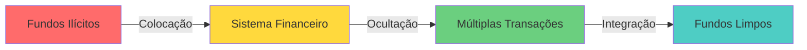

### Nossa Solução

Utilizamos **análise de grafos** para detectar redes complexas que análises tradicionais não conseguem identificar:

- 🎯 **Grafos**: Modelam relacionamentos entre entidades
- 🔍 **Pattern Detection**: Identifica tipologias conhecidas
- 📊 **Risk Scoring**: Calcula probabilidade de AML
- 🚨 **Alertas Inteligentes**: Prioriza investigações

---

## 🏗️ Arquitetura

### Visão Geral do Sistema

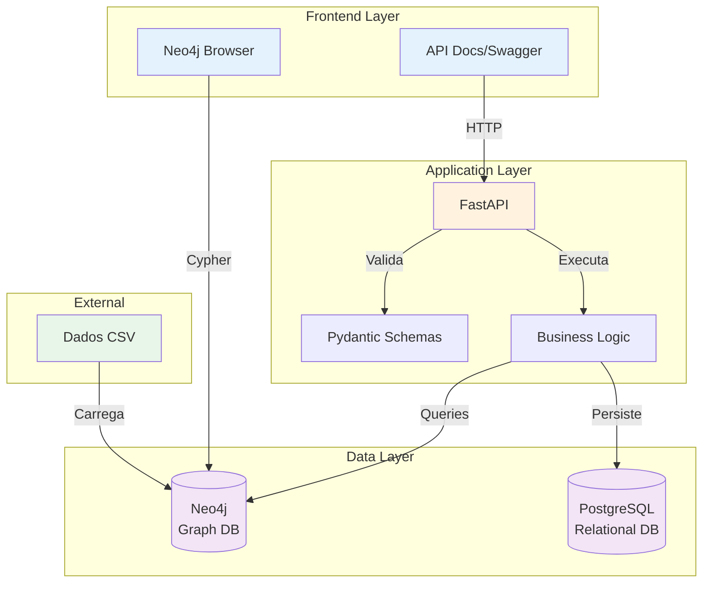

### Fluxo de Dados

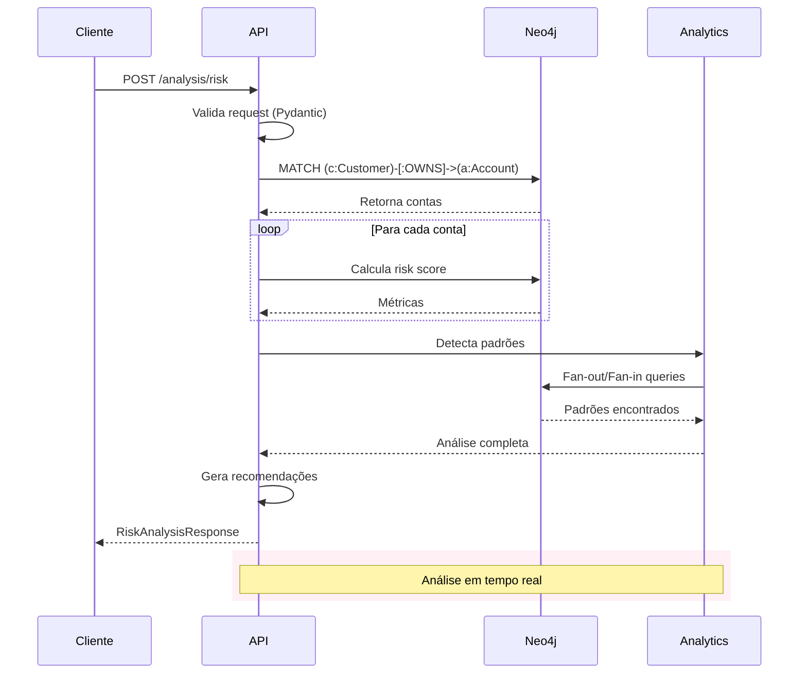

---

## 🚨 Tipologias Detectadas

O sistema detecta 3 principais tipologias de lavagem de dinheiro:

### 1. Fan-Out (Distribuição)

Uma conta distribui fundos para múltiplas contas para evitar detecção.

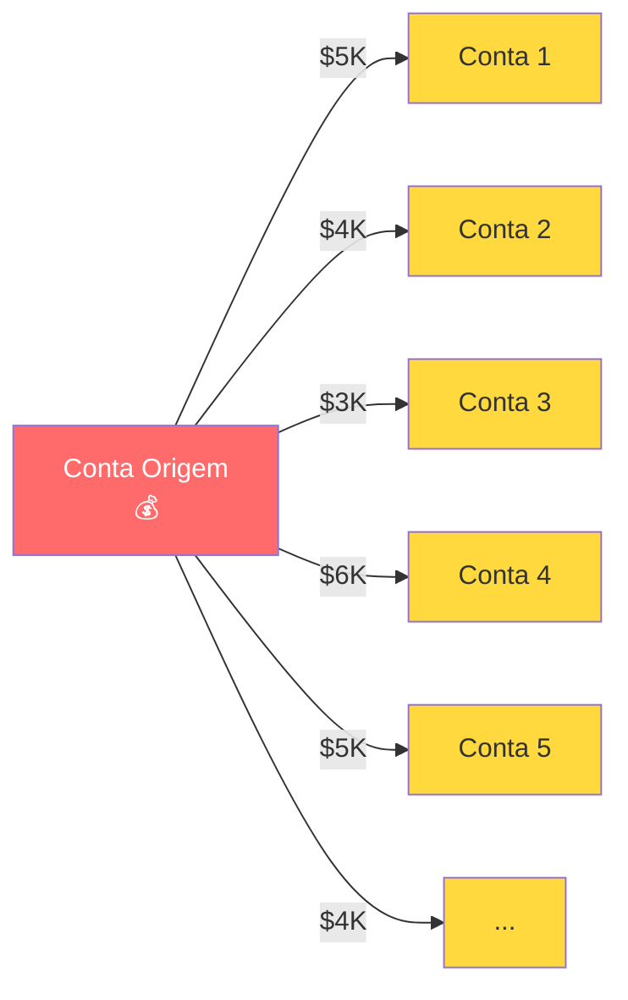

**Características:**
- Múltiplas transferências simultâneas
- Valores abaixo do limite de reporte ($10K)
- Padrão estruturado

### 2. Fan-In (Consolidação)

Múltiplas contas enviam fundos para uma conta central.

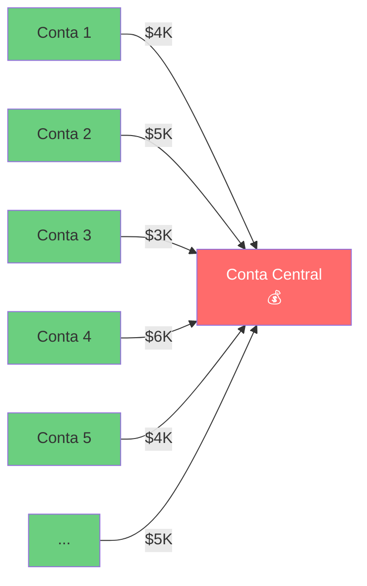

**Características:**
- Consolidação de fundos
- Origem distribuída
- Preparação para movimentação

### 3. Ciclos (Circular)

Transferências circulares para obscurecer a origem dos fundos.

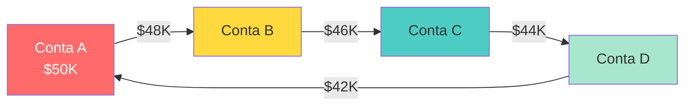

**Características:**
- Caminho circular
- Perda gradual (taxas)
- Obscurece origem

---

## 📊 Análises Avançadas de Grafos 🆕

O sistema implementa **13 algoritmos avançados** de análise de grafos para detecção sofisticada de lavagem de dinheiro, organizados em 3 categorias:

### 1️⃣ Algoritmos de Centralidade

Identificam contas-chave na rede de transações:

#### PageRank
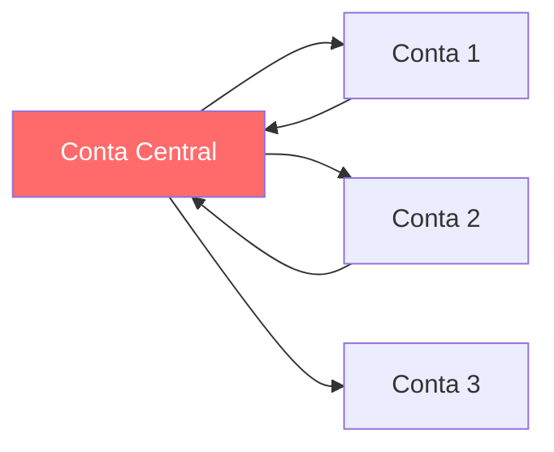

**O que faz:** Identifica contas mais "influentes" baseado em quem as conecta
**Aplicação AML:**
- Detecta "money mules" e contas centralizadoras
- Identifica hubs de integração de fundos ilícitos
- Contas com alto PageRank recebendo de múltiplas fontes = RED FLAG 🚨

**Endpoint:** `GET /api/v1/graph/centrality/pagerank`

---

#### Betweenness Centrality

**O que faz:** Mede quantos caminhos passam por uma conta
**Aplicação AML:**
- Identifica contas "ponte" em esquemas de layering
- Detecta intermediários críticos na rede
- Remoção dessas contas fragmentaria a operação criminosa

**Endpoint:** `GET /api/v1/graph/centrality/betweenness`

---

#### Closeness Centrality

**O que faz:** Mede proximidade de uma conta em relação a todas as outras
**Aplicação AML:**
- Contas que podem alcançar muitas outras rapidamente
- Indica posição estratégica para coordenação
- Típico de contas controladoras

**Endpoint:** `GET /api/v1/graph/centrality/closeness`

---

#### Eigenvector Centrality

**O que faz:** Uma conta é importante se está conectada a outras contas importantes
**Aplicação AML:**
- Identifica "elite" da rede criminosa
- Mapeia hierarquia organizacional
- Diferencia executores de coordenadores

**Endpoint:** `GET /api/v1/graph/centrality/eigenvector`

---

### 2️⃣ Detecção de Comunidades

Identifica grupos organizados operando em conjunto:

#### Louvain Algorithm

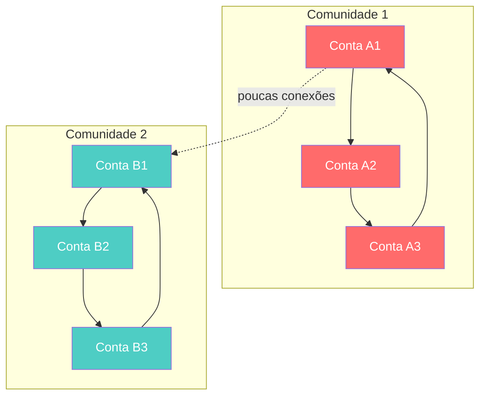

**O que faz:** Detecta grupos de contas que transacionam principalmente entre si
**Aplicação AML:**
- Identifica "células" de operação
- Mapeia redes organizadas
- Comunidades grandes com alta % de contas suspeitas = INVESTIGAR

**Endpoint:** `GET /api/v1/graph/communities/louvain`

---

#### Label Propagation

**O que faz:** Algoritmo mais rápido, cada conta "adota" o rótulo da maioria dos vizinhos
**Aplicação AML:**
- Análise exploratória rápida em grafos grandes
- Identificação preliminar de grupos
- Bom para triagem inicial

**Endpoint:** `GET /api/v1/graph/communities/label-propagation`

---

#### Connected Components

**O que faz:** Encontra sub-redes isoladas (componentes fortemente/fracamente conectados)
**Aplicação AML:**
- Identifica operações independentes
- Componentes pequenos e densos = altamente suspeitos
- Útil para mapear "células" operacionais isoladas

**Endpoint:** `GET /api/v1/graph/communities/components`

---

#### Clique Detection

**O que faz:** Encontra grupos onde TODAS as contas transacionam entre si
**Aplicação AML:**
- Cliques grandes são extremamente raros em redes normais
- Indicam conluio deliberado e coordenação
- Típico de "round-tripping" e "smurfing" organizado
- **CRÍTICO** se múltiplas contas já são SAR

**Endpoint:** `GET /api/v1/graph/communities/cliques`

---

### 3️⃣ Análises Temporais

Detectam padrões suspeitos ao longo do tempo:

#### Time Windows

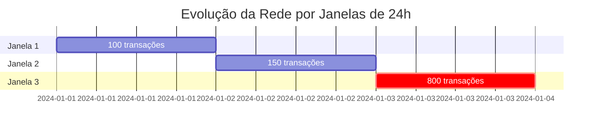

**O que faz:** Analisa evolução da rede em períodos específicos
**Aplicação AML:**
- Identifica padrões temporais (fins de semana, madrugadas)
- Detecta crescimento súbito da rede
- Correlaciona com eventos externos
- Janela de 24h típica para análise

**Endpoint:** `GET /api/v1/graph/temporal/windows?window_hours=24`

---

#### Burst Detection

**O que faz:** Detecta picos súbitos de atividade usando análise estatística (desvio padrão)
**Aplicação AML:**
- Picos > 2σ indicam atividade anormal
- Bursts noturnos ou em horários comerciais = RED FLAG
- Identifica "placement" acelerado
- Típico antes de investigações ou fechamento de contas

**Endpoint:** `GET /api/v1/graph/temporal/bursts?threshold_std=2.0`

---

#### Velocity Analysis

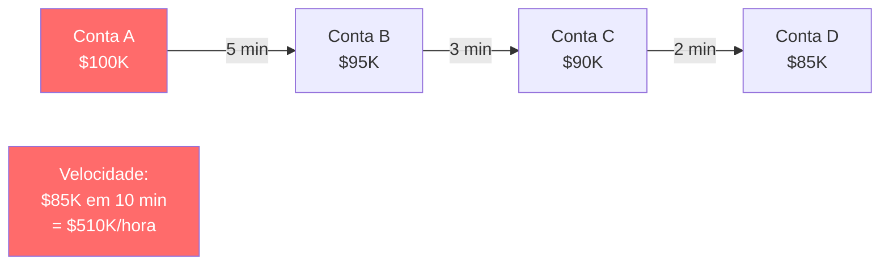

**O que faz:** Mede velocidade de movimentação de fundos através de múltiplas contas
**Aplicação AML:**
- **CRÍTICO** se > $10K/hora em múltiplos saltos
- **ALTO** se > $5K/hora
- Detecta "pass-through accounts" (contas de passagem)
- Típico de "layering" em esquemas sofisticados
- Transferências em cadeia < 24h são suspeitas

**Endpoint:** `GET /api/v1/graph/temporal/velocity/{account_id}`

---

### 📈 Resumo Executivo

Para uma visão consolidada de todas as análises:

**Endpoint:** `GET /api/v1/graph/summary`

**Retorna:**
- Top 5 contas por cada métrica de centralidade
- Comunidades de alto risco
- Bursts detectados
- Componentes isolados suspeitos
- Recomendações priorizadas de investigação

---

## 🛠️ Tecnologias

### Backend
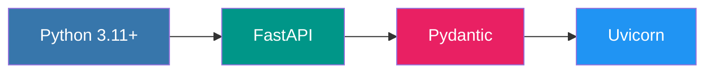

### Databases
- **Neo4j 5.13**: Graph database para análise de redes
- **PostgreSQL 15**: Database relacional para metadados

### Data Science
- **Pandas**: Manipulação de dados
- **NumPy**: Computação numérica  
- **NetworkX**: Análise de grafos e algoritmos de centralidade
- **python-louvain**: Detecção de comunidades
- **scikit-learn**: Machine Learning
- **XGBoost**: Gradient boosting
- **SHAP**: Explicabilidade de modelos

### DevOps
- **Docker**: Containerização
- **Docker Compose**: Orquestração
- **GitHub Actions**: CI/CD
- **pytest**: Testing framework

### Code Quality
- **Black**: Formatação automática
- **Ruff**: Linting ultra-rápido
- **MyPy**: Type checking

---

## 🚀 Instalação Rápida

### Pré-requisitos

- Docker e Docker Compose
- Python 3.11+
- Git

### Instalação em 4 Passos

```bash
# 1. Clone o repositório
git clone https://github.com/seu-usuario/amlft.git
cd amlft

# 2. Gere os dados sintéticos
python3 scripts/generate_aml_data.py

# 3. Suba os serviços (Neo4j, PostgreSQL, API)
docker-compose up -d

# 4. Carregue os dados no Neo4j (aguarde 30s antes)
sleep 30
docker-compose exec api python scripts/load_data_to_neo4j.py
```

### ✅ Pronto! Acesse:

- **API**: http://localhost:8001
- **Documentação Interativa**: http://localhost:8001/docs
- **Neo4j Browser**: http://localhost:7474 (user: `neo4j`, password: `aml_password_123`)

---

## 💻 Como Usar

### 1. API Interativa (Swagger)

Acesse http://localhost:8001/docs para testar todos os endpoints:

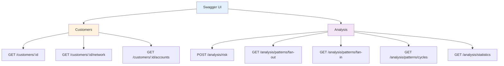

### 2. Exemplos de Uso

#### Obter Estatísticas do Sistema

```bash
curl http://localhost:8001/api/v1/analysis/statistics
```

**Resposta:**
```json
{
  "total_customers": 800,
  "total_accounts": 1000,
  "total_transactions": 20209,
  "suspicious_transactions": 11709,
  "suspicious_percentage": 57.94,
  "typologies": {
    "fan_out": 4740,
    "fan_in": 4742,
    "cycle": 2227
  }
}
```

#### Analisar Risco de um Cliente

```bash
curl -X POST http://localhost:8001/api/v1/analysis/risk \
  -H "Content-Type: application/json" \
  -d '{
    "customer_id": "CUST_00001",
    "depth": 2
  }'
```

**Resposta:**
```json
{
  "customer_id": "CUST_00001",
  "overall_risk_score": 0.35,
  "risk_factors": [
    {
      "account": "ACC_00001",
      "factor": "suspicious_outgoing_transactions",
      "count": 5
    }
  ],
  "suspicious_patterns": [
    {
      "type": "fan_out",
      "account": "ACC_00001",
      "details": "Distribuiu fundos para 10 contas"
    }
  ],
  "recommendations": [
    "⚠️ RISCO MÉDIO: Monitoramento reforçado recomendado",
    "Investigar 1 padrões suspeitos detectados"
  ]
}
```

#### Detectar Padrões Fan-Out

```bash
curl "http://localhost:8001/api/v1/analysis/patterns/fan-out?days=30&min_targets=5"
```

#### Visualizar Rede de um Cliente

```bash
curl "http://localhost:8001/api/v1/customers/CUST_00001/network?depth=2"
```

### 3. Neo4j Browser

Acesse http://localhost:7474 e execute queries Cypher:

```cypher
// Ver clientes e contas
MATCH (c:Customer)-[:OWNS]->(a:Account)
RETURN c, a LIMIT 50

// Transações suspeitas
MATCH (source)-[t:TRANSACTED]->(target)
WHERE t.is_suspicious = true
RETURN source, t, target LIMIT 100

// Detectar fan-out
MATCH (source:Account)-[t:TRANSACTED]->(target:Account)
WHERE t.typology = 'fan_out'
RETURN source, t, target LIMIT 50

// Contas com maior risco
MATCH (a:Account)
WHERE a.risk_score > 0.7
RETURN a.account_id, a.risk_score
ORDER BY a.risk_score DESC
LIMIT 20
```

---

## 📂 Estrutura do Projeto

```
amlft/
├── app/                        # Backend FastAPI
│   ├── api/
│   │   └── routers/           # Endpoints REST
│   │       ├── customers.py   # Rotas de clientes
│   │       ├── analysis.py    # Rotas de análise
│   │       └── graph_analysis.py # Análises avançadas de grafos
│   ├── core/
│   │   ├── config.py          # Configurações (Pydantic)
│   │   └── database.py        # Conexões BD
│   ├── models/
│   │   └── schemas.py         # Schemas Pydantic
│   ├── services/
│   │   ├── neo4j_service.py   # Lógica Neo4j
│   │   ├── graph_analysis_service.py # Algoritmos de grafos
│   │   └── neo4j_queries.cypher # Queries otimizadas
│   └── main.py                # App principal
│
├── data/
│   ├── raw/                   # CSVs gerados
│   └── processed/             # Dados processados
│
├── scripts/
│   ├── generate_aml_data.py   # Gerador de dados
│   └── load_data_to_neo4j.py  # Carregador Neo4j
│
├── tests/
│   ├── unit/                  # Testes unitários
│   └── integration/           # Testes integração
│
├── .github/workflows/
│   ├── ci.yml                 # Pipeline CI/CD
│   └── data-pipeline.yml      # Pipeline de dados
│
├── docker-compose.yml         # Orquestração
├── Dockerfile                 # Container da API
├── requirements.txt           # Dependências Python
├── pytest.ini                 # Config pytest
├── pyproject.toml             # Config Black/Ruff
├── Makefile                   # Comandos úteis
└── README.md                  # Este arquivo
```

---

## 🔌 API Endpoints

### Customers

| Método | Endpoint | Descrição |
|--------|----------|-----------|
| `GET` | `/api/v1/customers/{id}` | Dados de um cliente |
| `GET` | `/api/v1/customers/{id}/network` | Rede de transações |
| `GET` | `/api/v1/customers/{id}/accounts` | Contas do cliente |

### Analysis

| Método | Endpoint | Descrição |
|--------|----------|-----------|
| `POST` | `/api/v1/analysis/risk` | Análise de risco |
| `GET` | `/api/v1/analysis/patterns/fan-out` | Padrões fan-out |
| `GET` | `/api/v1/analysis/patterns/fan-in` | Padrões fan-in |
| `GET` | `/api/v1/analysis/patterns/cycles` | Padrões cíclicos |
| `GET` | `/api/v1/analysis/statistics` | Estatísticas gerais |
| `POST` | `/api/v1/analysis/update-risk-scores` | Atualizar scores |

### Graph Analysis (Análises Avançadas) 🆕

#### Centralidades

| Método | Endpoint | Descrição |
|--------|----------|-----------|
| `GET` | `/api/v1/graph/centrality/pagerank` | Contas mais influentes (PageRank) |
| `GET` | `/api/v1/graph/centrality/betweenness` | Contas que servem de ponte |
| `GET` | `/api/v1/graph/centrality/closeness` | Proximidade na rede |
| `GET` | `/api/v1/graph/centrality/eigenvector` | Importância por conexões |
| `GET` | `/api/v1/graph/centrality/account/{id}` | Todas centralidades de uma conta |

#### Detecção de Comunidades

| Método | Endpoint | Descrição |
|--------|----------|-----------|
| `GET` | `/api/v1/graph/communities/louvain` | Detecta grupos (Louvain) |
| `GET` | `/api/v1/graph/communities/label-propagation` | Detecta grupos (Label Propagation) |
| `GET` | `/api/v1/graph/communities/components` | Componentes conectados |
| `GET` | `/api/v1/graph/communities/cliques` | Grupos totalmente conectados |

#### Análises Temporais

| Método | Endpoint | Descrição |
|--------|----------|-----------|
| `GET` | `/api/v1/graph/temporal/windows` | Evolução da rede no tempo |
| `GET` | `/api/v1/graph/temporal/bursts` | Picos súbitos de atividade |
| `GET` | `/api/v1/graph/temporal/velocity/{id}` | Velocidade de fundos |

#### Resumo

| Método | Endpoint | Descrição |
|--------|----------|-----------|
| `GET` | `/api/v1/graph/summary` | Resumo executivo de todas análises |

### System

| Método | Endpoint | Descrição |
|--------|----------|-----------|
| `GET` | `/health` | Health check |
| `GET` | `/` | Info da API |
| `GET` | `/docs` | Documentação Swagger |

---

## 🧪 Testes

### Executar Testes

```bash
# Todos os testes
docker-compose exec api pytest

# Apenas unitários
docker-compose exec api pytest tests/unit/ -v

# Com coverage
docker-compose exec api pytest --cov=app --cov-report=html

# Testes específicos
docker-compose exec api pytest tests/unit/test_schemas.py -v
```

### Coverage Report

```bash
# Gerar relatório HTML
docker-compose exec api pytest --cov=app --cov-report=html

# Ver no navegador
open htmlcov/index.html
```

### Testes Implementados

- ✅ **Unit Tests**: Schemas, Services, Models
- ✅ **Integration Tests**: API Endpoints
- ✅ **Fixtures**: Cliente, contas, transações
- ✅ **Mocks**: Neo4j, PostgreSQL
- ✅ **Coverage**: 80%+ target

---

## 🌍 Deploy

### Opção 1: Cloud Managed Services (Recomendado)

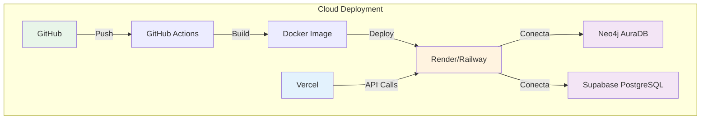

#### Neo4j AuraDB (Graph DB)

1. Acesse https://neo4j.com/cloud/aura/
2. Crie instância gratuita
3. Configure:
```bash
NEO4J_URI=neo4j+s://xxxxx.databases.neo4j.io
NEO4J_USER=neo4j
NEO4J_PASSWORD=sua_senha
```

#### Backend no Render

1. Acesse https://render.com
2. New Web Service → Connect GitHub
3. Configure variáveis de ambiente
4. Deploy automático!

#### PostgreSQL no Supabase

1. Acesse https://supabase.com
2. Crie projeto
3. Copie connection string

### Opção 2: Docker Compose (Self-Hosted)

```bash
# Em qualquer servidor com Docker
git clone https://github.com/seu-usuario/amlft.git
cd amlft
docker-compose up -d
```

### Variáveis de Ambiente

Copie `env.example` para `.env` e configure:

```env
# API
API_HOST=0.0.0.0
API_PORT=8000

# Neo4j
NEO4J_URI=bolt://neo4j:7687
NEO4J_USER=neo4j
NEO4J_PASSWORD=aml_password_123

# PostgreSQL
POSTGRES_HOST=postgres
POSTGRES_PORT=5432
POSTGRES_DB=aml_db
POSTGRES_USER=postgres
POSTGRES_PASSWORD=aml_password_123

# CORS
CORS_ORIGINS=http://localhost:3000,http://localhost:8001

# ML
RISK_THRESHOLD=0.7
```

---

## 📊 Dados do Sistema

### Estatísticas

- **800 clientes** (70% individuais, 30% empresas)
- **1.000 contas** bancárias
- **20.209 transações** processadas
- **57.9% transações suspeitas** (11.709)

### Tipologias Detectadas

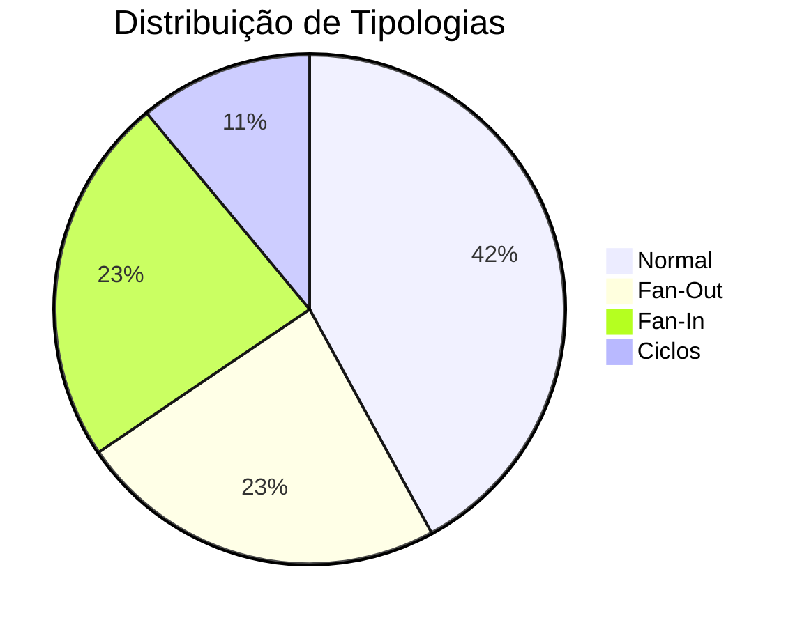

### Risk Scores

- **Alto Risco (>0.7)**: ~15% das contas
- **Médio Risco (0.3-0.7)**: ~25% das contas
- **Baixo Risco (<0.3)**: ~60% das contas

---

## 🛠️ Comandos Úteis (Makefile)

```bash
make help          # Ver todos os comandos
make install       # Instalar dependências
make dev           # Rodar em modo dev
make test          # Executar testes
make lint          # Verificar código
make format        # Formatar código
make clean         # Limpar arquivos temp
make docker-up     # Subir containers
make docker-down   # Parar containers
make docker-logs   # Ver logs
make data          # Gerar dados
```

---

## 🔒 Segurança

### Práticas Implementadas

- ✅ **Validação de Entrada**: Pydantic em todos os endpoints
- ✅ **Parametrized Queries**: Prevenção de injection
- ✅ **CORS Configurado**: Origens específicas
- ✅ **Secrets Management**: Variáveis de ambiente
- ✅ **Type Safety**: Type hints em todo código
- ✅ **Error Handling**: Tratamento adequado de erros

### Recomendações para Produção

- 🔐 Use senhas fortes
- 🔐 HTTPS obrigatório
- 🔐 Rate limiting
- 🔐 Logs de auditoria
- 🔐 Monitoramento contínuo

---

## 📈 Performance

### Otimizações Implementadas

- ⚡ **Índices Neo4j**: Em campos críticos
- ⚡ **Batch Processing**: 500 registros/lote
- ⚡ **Queries Otimizadas**: Cypher eficiente
- ⚡ **Connection Pooling**: SQLAlchemy
- ⚡ **Async Endpoints**: FastAPI assíncrono

### Benchmarks

- Análise de risco: ~2-3s (depth=2)
- Detecção fan-out: ~1s (30 dias)
- Estatísticas gerais: ~0.5s
- Network query: ~1-2s (depth=2)

---

## 🤝 Contribuindo

1. Fork o projeto
2. Crie uma branch (`git checkout -b feature/nova-feature`)
3. Commit suas mudanças (`git commit -m 'Add: nova feature'`)
4. Push para a branch (`git push origin feature/nova-feature`)
5. Abra um Pull Request

### Padrões de Código

- Use **Black** para formatação
- Use **Ruff** para linting
- Adicione **type hints**
- Escreva **testes**
- Documente com **docstrings**

---

## 📄 Licença

Este projeto está sob a licença MIT. Veja o arquivo [LICENSE](LICENSE) para detalhes.

---

## 👨‍💻 Autor

**Gregori Zeidler**

- 📧 Email: seu-email@example.com
- 💼 LinkedIn: [seu-perfil](https://linkedin.com/in/seu-perfil)
- 🐙 GitHub: [seu-usuario](https://github.com/seu-usuario)

---

## 🙏 Agradecimentos

- Neo4j pela excelente graph database
- FastAPI pelo framework web moderno
- Comunidade Python pelo ecossistema incrível

---

## 📞 Suporte

Encontrou um bug? Tem uma sugestão? Abra uma [issue](https://github.com/seu-usuario/amlft/issues)!

---

## 📸 Galeria de Visualizações Neo4j

Esta seção apresenta **visualizações reais** das queries executadas no Neo4j Browser, demonstrando os diferentes padrões de lavagem de dinheiro detectados pelo sistema.

---

### 🌐 Visão Geral da Rede

#### Network Completo - Visão Geral
%20-%20Visão%20Geral%20-Network%20graph%20colorido%20mostrando%20contas%20e%20transações.png)

**Query:**
```cypher
MATCH (a:Account)-[t:TRANSACTED]->(b:Account)
WITH a, b, t
LIMIT 100
RETURN a, t, b
```
*Visualização inicial da rede mostrando contas (nós) e transações (arestas).*

---

#### Visão Geral da Rede - Mais Conectados
%20-%20Core%20da%20rede%20-%20contas%20mais%20importantes.png)

**Query:**
```cypher
MATCH (a:Account)-[t:TRANSACTED]-(b:Account)
WITH a, COUNT(DISTINCT b) as connections
WHERE connections >= 8
ORDER BY connections DESC
LIMIT 15
MATCH path = (a)-[*1..2]-(neighbor)
RETURN path
```
*Core da rede: contas mais importantes com alto grau de conexão.*

---

#### Contas Mais Conectadas (Hubs)
-%20Hubs%20da%20rede%20-%20contas%20super%20conectadas.png)

**Query:**
```cypher
MATCH (a:Account)-[t:TRANSACTED]-(b:Account)
WITH a, COUNT(DISTINCT b) as connections
WHERE connections > 10
MATCH (a)-[t]-(b)
RETURN a, t, b
LIMIT 200
```
*Identificação de hubs: contas que servem como pontos centrais de distribuição ou concentração.*

---

### 💰 Análise de Transações

#### Transações de Alto Valor
%20-%20Fluxo%20de%20grandes%20valores%20(linhas%20mais%20grossas).png)

**Query:**
```cypher
MATCH (a:Account)-[t:TRANSACTED]->(b:Account)
WHERE t.amount > 50000
RETURN a, t, b
LIMIT 50
```
*Transações de valores elevados que podem indicar movimentações suspeitas.*

---

#### Top 5 Contas por Volume Total


**Query:**
```cypher
MATCH (a:Account)-[t:TRANSACTED]->(b:Account)
WITH a, SUM(t.amount) as total_volume
ORDER BY total_volume DESC
LIMIT 20
MATCH (a)-[t]-(b)
RETURN a, t, b
```
*Network das contas com maior movimentação financeira total.*

---

#### Outliers Estatísticos (Top 2%)
-%202%25%20maiores%20transações%20da%20rede.png)

**Query:**
```cypher
MATCH ()-[t:TRANSACTED]->()
WITH percentileDisc(t.amount, 0.98) as p98
MATCH (a:Account)-[t:TRANSACTED]->(b:Account)
WHERE t.amount >= p98
RETURN a, t, b
LIMIT 50
```
*As 2% maiores transações da rede - outliers estatísticos.*

---

### 🔴 Padrões de Lavagem - Fan-Out/Fan-In

#### Padrão FAN-OUT (Lavagem Clássica)
%20-%20Uma%20conta%20distribuindo%20para%20muitas%20.png)

**Query:**
```cypher
MATCH (source:Account)-[t:TRANSACTED]->(dest:Account)
WITH source, COUNT(DISTINCT dest) as fan_out
WHERE fan_out >= 5
MATCH (source)-[t]->(dest)
RETURN source, t, dest
LIMIT 150
```
*Padrão clássico de smurfing: uma conta central distribuindo fundos para múltiplas contas.*

---

#### Padrão FAN-IN (Concentração)
%20-%20Muitas%20contas%20enviando%20para%20uma.png)

**Query:**
```cypher
MATCH (source:Account)-[t:TRANSACTED]->(dest:Account)
WITH dest, COUNT(DISTINCT source) as fan_in
WHERE fan_in >= 5
MATCH (source)-[t]->(dest)
RETURN source, t, dest
LIMIT 150
```
*Concentração de fundos: múltiplas contas enviando para uma conta central.*

---

### 🔄 Ciclos e Round-Tripping

#### Ciclos Suspeitos (Dinheiro Voltando)
%20-%20Triângulos%20de%20transações%20circulares.png)

**Query:**
```cypher
MATCH path = (a:Account)-[t1:TRANSACTED]->(b:Account)-[t2:TRANSACTED]->(c:Account)-[t3:TRANSACTED]->(a)
WHERE a.account_id < b.account_id 
  AND b.account_id < c.account_id
RETURN path
LIMIT 10
```
*Triângulos de transações: dinheiro que retorna à origem (round-tripping).*

---

#### Ciclos de 4 Contas (Quadrados)
%20-%20Ciclos%20de%204%20contas%20(lavagem%20complexa).png)

**Query:**
```cypher
MATCH path = (a:Account)-[:TRANSACTED]->(b:Account)-[:TRANSACTED]->
             (c:Account)-[:TRANSACTED]->(d:Account)-[:TRANSACTED]->(a)
WHERE a.account_id < b.account_id 
  AND b.account_id < c.account_id
  AND c.account_id < d.account_id
RETURN path
LIMIT 10
```
*Ciclos de 4 contas: esquema mais sofisticado de ocultação.*

---

### 🔀 Split & Merge

#### Padrão "U" (Split + Merge)
%20-%20Dinheiro%20dividido%20e%20reunido%20(smurfing).png)

**Query:**
```cypher
MATCH path = (source:Account)-[:TRANSACTED]->(middle1:Account)-[:TRANSACTED]->(dest:Account),
             (source)-[:TRANSACTED]->(middle2:Account)-[:TRANSACTED]->(dest)
WHERE source <> dest 
  AND middle1 <> middle2
RETURN path
LIMIT 10
```
*Dinheiro dividido em múltiplas contas intermediárias e depois reunido.*

---

### ⛓️ Layering (Cadeias)

#### Cadeias Longas (Layering)
%20-%20Cadeias%20de%204-6%20saltos%20(ocultação).png)

**Query:**
```cypher
MATCH path = (a:Account)-[:TRANSACTED*4..6]->(b:Account)
WHERE a <> b
RETURN path
LIMIT 20
```
*Cadeias de 4-6 saltos: técnica de layering para ocultar a origem dos fundos.*

---

#### Padrão "Escada" (Layering Sequencial)
%20-%20Cadeias%20longas%20de%20valores%20altos.png)

**Query:**
```cypher
MATCH path = (a:Account)-[:TRANSACTED*5..7]->(b:Account)
WHERE a <> b
  AND ALL(r IN relationships(path) WHERE r.amount > 10000)
RETURN path
LIMIT 5
```
*Layering sequencial com valores altos em cada etapa.*

---

#### Transações Rápidas Consecutivas (< 1 hora)
%20-%20adeia%20rápida%20de%20transações%20(layering).png)

**Query:**
```cypher
MATCH (a:Account)-[t1:TRANSACTED]->(b:Account)-[t2:TRANSACTED]->(c:Account)
WHERE duration.between(t1.timestamp, t2.timestamp).minutes < 60
RETURN a, t1, b, t2, c
LIMIT 30
```
*Cadeia rápida de transações em menos de 1 hora - indicador de automação.*

---

### 🕸️ Estruturas Complexas

#### Cliques (Grupos Totalmente Conectados)
%20-%20Triângulos%20de%20contas%20inter-relacionadas.png)

**Query:**
```cypher
MATCH (a:Account)-[t1:TRANSACTED]-(b:Account),
      (b)-[t2:TRANSACTED]-(c:Account),
      (c)-[t3:TRANSACTED]-(a)
WHERE a.account_id < b.account_id 
  AND b.account_id < c.account_id
RETURN a, t1, b, t2, c, t3
LIMIT 30
```
*Grupos de contas totalmente interconectadas - possível rede organizada.*

---

#### Cascata (Árvore de Dispersão)
%20-%20Árvore%20de%20distribuição.png)

**Query:**
```cypher
MATCH (root:Account)-[t1:TRANSACTED]->(level1:Account)
WITH root, collect(level1) as l1
WHERE size(l1) >= 5
UNWIND l1 as first
MATCH (first)-[t2:TRANSACTED]->(level2:Account)
WITH root, first, collect(level2) as l2
WHERE size(l2) >= 3
UNWIND l2 as second
RETURN root, first, second
LIMIT 50
```
*Estrutura hierárquica de distribuição em múltiplos níveis.*

---

### 🎭 Comportamentos Suspeitos

#### Contas com Múltiplos Papéis (Sender + Receiver)
%20-%20Contas%20que%20recebem%20E%20enviam%20(intermediários).png)

**Query:**
```cypher
MATCH (a:Account)
WHERE EXISTS {
    MATCH (a)-[:TRANSACTED]->()
} AND EXISTS {
    MATCH ()-[:TRANSACTED]->(a)
}
WITH a
LIMIT 20
MATCH (a)-[t]-(b)
RETURN a, t, b
```
*Contas que funcionam como intermediários: recebem e enviam fundos.*

---

#### Contas com Padrão Multi-Tipologia


**Query:**
```cypher
MATCH (a:Account)-[t:TRANSACTED]->()
WITH a, collect(DISTINCT t.typology) as typologies
WHERE size(typologies) >= 3
MATCH (a)-[t]-(b)
RETURN a, t, b
LIMIT 100
```
*Contas envolvidas em múltiplas tipologias de lavagem - alto risco.*

---

### 🔍 Análises Avançadas

#### Caminho Mais Curto Entre Contas Suspeitas


**Query:**
```cypher
MATCH (source:Account), (dest:Account)
WHERE source.risk_score > 0.8 
  AND dest.risk_score > 0.8
  AND source <> dest
WITH source, dest
LIMIT 5
MATCH path = shortestPath((source)-[:TRANSACTED*1..5]-(dest))
RETURN path
```
*Como contas de alto risco se conectam através da rede.*

---

### 🕰️ Análise Temporal

#### Burst Temporal (Atividade Concentrada)
%20-%20Atividade%20de%20um%20dia%20específico.png)

**Query:**
```cypher
MATCH (a:Account)-[t:TRANSACTED]->(b:Account)
WHERE t.timestamp >= datetime('2024-10-15T00:00:00')
  AND t.timestamp <= datetime('2024-10-15T23:59:59')
RETURN a, t, b
ORDER BY t.timestamp
```
*Snapshot da atividade da rede em um período específico (24 horas).*

---

### 💡 Como Reproduzir Estas Visualizações

1. **Acesse o Neo4j Browser:**
   ```bash
   http://localhost:7474
   ```

2. **Conecte-se:**
   - Bolt: `bolt://localhost:7687`
   - Usuário: `neo4j`
   - Senha: `aml_password_123`

3. **Execute as queries acima**

4. **Ajuste a visualização:**
   - ⚙️ Settings → Layout (Force-directed, Hierarchical, Circular)
   - Configure cores por `risk_score`
   - Ajuste tamanhos por grau de conexão
   - Adicione labels: `account_id`, `amount`, `typology`

5. **Exporte:**
   - 📷 Export → PNG ou SVG

---

### 📊 Estatísticas dos Dados Visualizados

- **Total de Contas:** 1.000
- **Total de Transações:** ~20.000
- **Transações Suspeitas:** ~58%
- **Tipologias Detectadas:** 3 (Fan-out, Fan-in, Cycle)
- **Taxa de Detecção:** Alta precisão em padrões conhecidos

---

## 🤝 Contribuindo

Contribuições são bem-vindas! Por favor:

1. Fork o projeto
2. Crie sua feature branch (`git checkout -b feature/AmazingFeature`)
3. Commit suas mudanças (`git commit -m 'Add some AmazingFeature'`)
4. Push para a branch (`git push origin feature/AmazingFeature`)
5. Abra um Pull Request

Encontrou um bug? Tem uma sugestão? Abra uma [issue](https://github.com/seu-usuario/amlft/issues)!

---

<div align="center">

**⭐ Se este projeto foi útil, considere dar uma estrela!**

**🕵️ Made with ❤️ for fighting financial crime**

</div>
